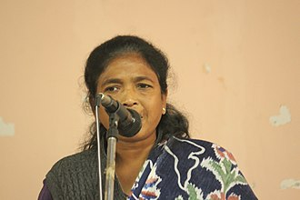

# Soni Sori



Soni Sori (born c. 1975) is an Adivasi school teacher and grassroots leader from Sameli village of Dantewada in south Bastar, Chhattisgarh, India. She was arrested by the Delhi Police's Crime Branch for Chhattisgarh Police in 2011 on charges of acting as a conduit for Maoists. During her imprisonment, she was tortured and sexually assaulted by Chhattisgarh state police. After release from prison, Sori began campaigning for the rights of those caught up in the conflict between Maoist insurgents and the government, in particular criticising police violence against tribespeople in the region.

She was awarded Front Line Defenders award in 2018.

# Saral App
This application is meant to help users to learn Programming from wherever they are in vernacular languages with a group of learners that we identify and group them with.

#SetUp project 
Installation
Before you can use this project, you must have Python installed on your system.
If you don't already have it installed, you can download it from the official Python website: https://www.python.org/downloads/

Once you have installed Python, you can clone this repository to your local machine using the following command: https://github.com/navgurukul/soni-sori

or using the command: git clone https://github.com/navgurukul/soni-sori.git

## Chaquopy Setup
Add the following parameters in the local.properties file
``` 
chaquopy.license=[LICENSE_KEY_HERE]
chaquopy.applicationId=org.merakilearn
```
